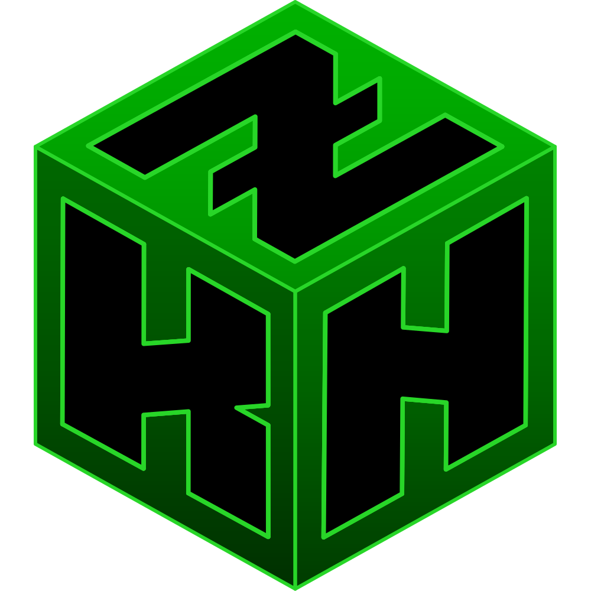

  

# Zero Knowledge Network

Privacy-first decentralized security infrastructure: post-quantum mixnets, zero-knowledge cryptography, and tamper-resistant secure edge hardware, composed as a unified substrate for **Secured Intention Coordination**.

## Repositories

### Network & Transport

- **[zknet](https://github.com/ZeroKnowledgeNetwork/zknet)** — ZKNetwork client, browser extension, and SDK monorepo
- **[opt](https://github.com/ZeroKnowledgeNetwork/opt)** — server plugins and client apps
- **[katzenpost](https://github.com/katzenpost/katzenpost)** — Post Quantum Anonymous Communication Network

### DAO & Governance

- **[aztec-ballot](https://github.com/zknet-labs/aztec-ballot)** — Aztec/Noir contracts for private delegated voting and operator-agent association with public reputation

---

## Public Goods

ZKNetwork is on Giveth as a public-goods project.

👉 **[giveth.io/project/zknetwork](https://giveth.io/project/zknetwork)**

---

## Be the Network

Privacy is security. Truth is verifiable. Intention drives value.
